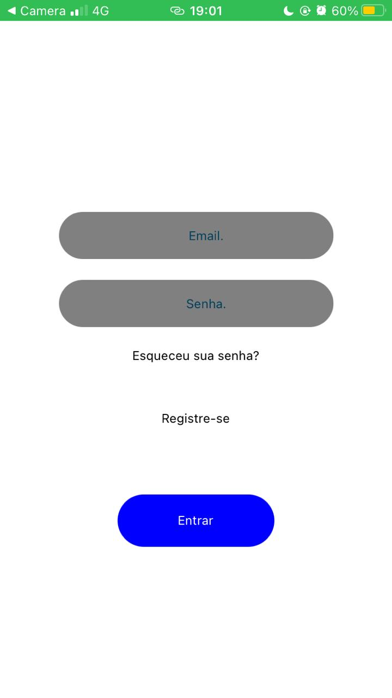

# COESTATE

Aplicativo desenvolvido para facilitar e intermediar a interação entre corretores imobiliários e pessoas com interesse em aluguel e/ou compra de casas/apartamentos através de anúncios das casas, com fotos, descrição e localização da mesma, agilizando e facilitando a comunicação.

## Telas
### Login

### Registro

### Home

### Detalhes

### Perfil

## Desenvolvedores
### João Pedro Rios
[Github](https://github.com/joaorios03)
[LinkedIn](https://www.linkedin.com/in/joao-pedro-rios/)
### Gabriel Barreto
[Github](https://github.com/Gbmrocha)
[LinkedIn](https://www.linkedin.com/in/gbmrocha/)
### Pedro Antonio Nunes
[Github](https://github.com/Z33DD)
[LinkedIn](https://www.linkedin.com/in/pedroantonionunesmoreira/)
